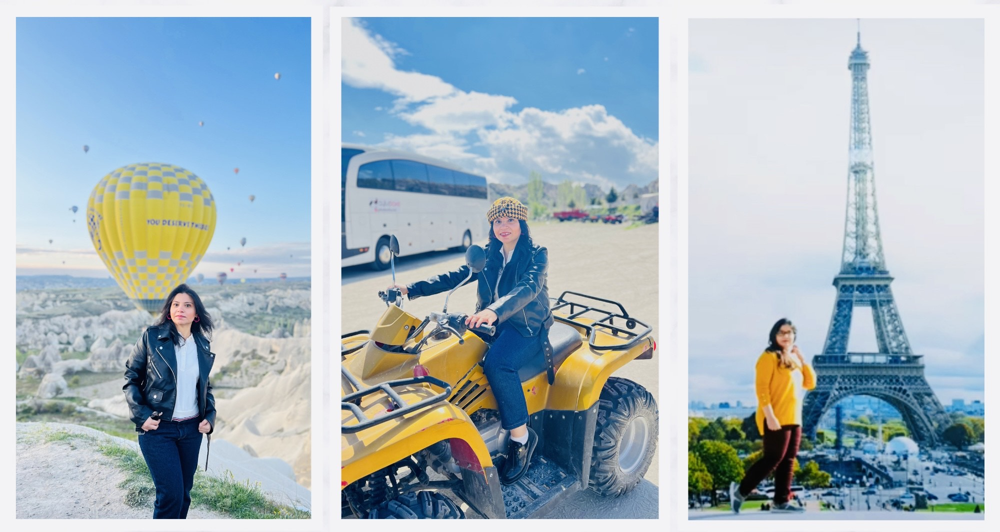

I’m a Senior IT Project Manager with 10+ years of experience leading the delivery of complex technology platforms across  FinTech, digital banking, and regulated environments. I specialize in Agile delivery, cross-border team leadership, and turning strategic priorities into measurable outcomes.

I’ve successfully delivered enterprise platforms that improved fraud detection, automated reporting, and enhanced operational efficiency. I partner with senior stakeholders, global vendors, and delivery teams to drive execution excellence.

I’m open to senior delivery leadership roles — where technology, data, and transformation intersect.

Outside of work, I’m an avid traveler and adventure enthusiast, having explored multiple cities across Turkey and the UAE, as well as several countries within the European Union. These experiences have strengthened my appreciation for diverse cultures, adaptability, and openness to new perspectives.

A glimpse beyond work: moments from my travel experiences.

